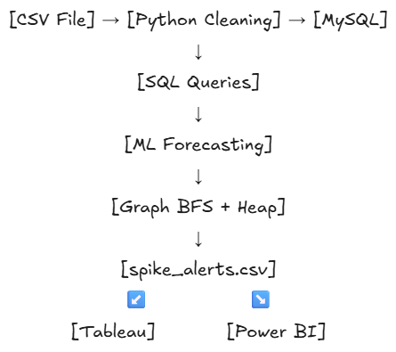

# Algorithmic Market Intelligence System

## What This Project Does
This system analyses 541,909 real e-commerce transactions to predict which 
products will see demand spikes in the next 7 days. It uses a graph-based 
co-purchase cluster engine built with BFS, and a heap-ranked urgency scorer, 
with results delivered as interactive Tableau and Power BI dashboards.

## Architecture

## Dataset
- Source: UCI Online Retail Dataset
- Raw data: 541,909 rows, 8 columns, UK gift retailer, 2010-2011
- After cleaning: 397,884 rows
- Link: https://archive.ics.uci.edu/dataset/352/online+retail

## Tech Stack
| Layer | Tool | Purpose |
|-------|------|---------|
| Storage | MySQL | Normalized 3-table schema |
| Cleaning | Python + Pandas | ETL pipeline |
| Analysis | SQL | Business queries |
| ML | Scikit-learn | Lag-feature demand forecasting |
| DSA | Python | Graph BFS + Min-Heap ranking |
| Visualization | Tableau | Exploratory dashboard |
| Visualization | Power BI | Operational spike alert dashboard |

## DSA Rationale (Why Graph + Heap?)
### Graph + BFS
Co-purchase relationships are naturally modelled as an undirected graph.
Each product is a node. Each "bought together" relationship is an edge.
BFS finds entire product clusters in O(V+E) time. If one product in a 
cluster is predicted to spike, the entire cluster is flagged. This mirrors 
how Amazon's "frequently bought together" engine works.

### Min-Heap
Finding Top-K urgent products from N products using a heap is O(N log K).
Sorting all N products would be O(N log N). For N=2845 and K=30, the heap 
is significantly faster. This is the same principle used in real-time 
recommendation systems at scale.

## Results
- Products modelled: 2,845
- Co-purchase pairs found: 174,662
- Product clusters identified: 60
- Largest cluster: 1,886 interconnected products
- HIGH SPIKE alerts: 6 products
- SPIKE alerts: 6 products
- Top urgency score: 273.4 (product 22102)

## Project Structure
market-intelligence-system/
├── README.md
├── requirements.txt
├── assets/
│   └── architecture.png
├── sql/
│   ├── schema.sql
│   └── queries.sql
├── notebooks/
│   ├── 01_cleaning.ipynb
│   └── 02_ml_engine.ipynb
├── dashboards/
│   ├── tableau_dashboard.png
│   └── powerbi_report.pbix
└── data/
    └── (CSVs not included - see Dataset section for download link)

## How To Run
1. Clone this repository
2. Install dependencies: pip install -r requirements.txt
3. Download dataset from UCI link above, save as data/online_retail.csv
4. Set up MySQL and run sql/schema.sql
5. Run notebooks/01_cleaning.ipynb (all cells)
6. Run notebooks/02_ml_engine.ipynb (all cells)
7. Open dashboards in Tableau Public and Power BI Desktop